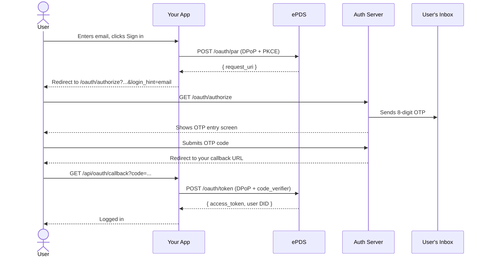
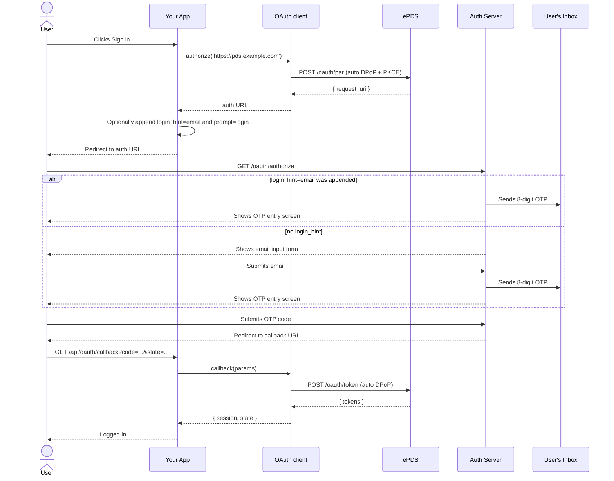

# Flow Walkthroughs

## Which flow should I use?

| Path                 | App type                          | App provides                                               | Implementation                                                                                                                                                      |
| -------------------- | --------------------------------- | ---------------------------------------------------------- | ------------------------------------------------------------------------------------------------------------------------------------------------------------------- |
| Browser OAuth client | Browser-only SPA or public client | PDS URL for email-first/no-identifier login, or handle/DID | `BrowserOAuthClient.authorize()`, append email `login_hint` and `prompt=login` to the returned authorize URL, then `init()` consumes the callback                   |
| Node OAuth client    | Server app or confidential client | PDS URL for email-first/no-identifier login, or handle/DID | `NodeOAuthClient.authorize()`, append email `login_hint` and `prompt=login` to the returned authorize URL, then `callback()` consumes the callback                  |
| Hand-rolled fallback | Any runtime                       | Email address                                              | Implement PAR, PKCE, DPoP, nonce retry, and token exchange yourself only if the OAuth client cannot expose the authorize URL or ePDS stops honoring URL-level hints |

Use the OAuth clients first. They handle PAR, PKCE, DPoP, nonce retry, token
exchange, and session management automatically. For email-first OTP, pass the
PDS URL to `authorize()` and append the raw email as `login_hint` to the returned
`/oauth/authorize` URL. Do **not** put email `login_hint` in the PAR body.

Use these input variants with the same client code:

- **Email-first OTP** — pass the PDS URL, then append `login_hint=<email>` and `prompt=login` to the returned URL.
- **No identifier** — pass the PDS URL; auth server shows its own email form.
- **Handle** — pass `alice.pds.example.com`; this fork shows the stock PDS handle/password page.
- **DID** — pass `did:plc:abc123...`; same as handle.

All paths end with ePDS redirecting back to your app with an authorization code.

---

## Browser apps — Using `BrowserOAuthClient`

### Setup

Use `@atproto/oauth-client-browser` for browser-only apps. See the
[SKILL.md quick start](../SKILL.md) for public browser client metadata.

### Login handler

```typescript
import { BrowserOAuthClient } from '@atproto/oauth-client-browser'

const client = await BrowserOAuthClient.load({
  clientId: 'https://yourapp.example.com/client-metadata.json',
})

const url = await client.authorize('https://pds.example.com', {
  scope: 'atproto transition:generic',
  prompt: 'login',
})
url.searchParams.set('login_hint', email)
url.searchParams.set('prompt', 'login')
window.location.assign(url.toString())
```

Use `authorize()` rather than `signInRedirect()` when you need email-first OTP,
because `signInRedirect()` redirects before you can append `login_hint`.

### Restore or consume the callback

```typescript
const result = await client.init()
const session = result?.session
```

The `init()` method:

1. Detects OAuth callback parameters in the current URL.
2. Validates state from browser storage.
3. Exchanges the authorization code for tokens with DPoP.
4. Restores any existing session when there is no callback to consume.

---

## Server apps — Using `NodeOAuthClient`

### Setup

See the [SKILL.md quick start](../SKILL.md) for `NodeOAuthClient`
construction (client metadata, keyset, stores).

### Login handler

```typescript
// Email-first OTP — pass the PDS URL, then patch the authorize URL
const emailUrl = await client.authorize('https://pds.example.com', {
  prompt: 'login',
})
emailUrl.searchParams.set('login_hint', email)
emailUrl.searchParams.set('prompt', 'login')

// No identifier — auth server shows email form
const pdsUrl = await client.authorize('https://pds.example.com')

// With a handle — stock PDS handle/password page
const handleUrl = await client.authorize('alice.pds.example.com')

// With a DID — same behaviour as handle
const didUrl = await client.authorize('did:plc:abc123...')
```

The `authorize()` method:

1. Resolves the input (handle → DID → PDS endpoint, or uses the PDS URL directly).
2. Sends a PAR request with PKCE and DPoP (including nonce retry).
3. Stores the OAuth state in your `stateStore`.
4. Returns the authorization URL to redirect the user to.

Redirect the user's browser to the returned URL.

### Callback handler

```typescript
// GET /api/oauth/callback?code=...&state=...&iss=...
const { session, state } = await client.callback(
  new URLSearchParams(callbackQueryString),
)

const userDid = session.did // e.g. "did:plc:abc123..."
// session.fetchHandler() returns an authenticated fetch for AT Protocol API calls
```

The `callback()` method:

1. Validates the state against your `stateStore`
2. Exchanges the authorization code for tokens (with DPoP)
3. Stores the session in your `sessionStore`
4. Returns the `OAuthSession` and original state

### Restoring a session

```typescript
const session = await client.restore(userDid)
// Use session.fetchHandler() for API calls
// session.signOut() to end the session
```

### Step-by-step (email-first OTP)

1. User enters an email and clicks "Sign in" in your app.
2. Your login handler calls `client.authorize('https://pds.example.com')`.
3. Library sends PAR request, gets `request_uri`, and stores state.
4. Your app appends `login_hint=<email>` and `prompt=login` to the returned auth URL.
5. Your app redirects browser to the patched auth URL.
6. Auth server sends OTP and shows the OTP entry screen.
7. User enters the OTP.
8. **New users only**: ePDS shows a handle picker.
9. Auth server redirects to your `redirect_uri` with `?code=&state=&iss=`.
10. Your callback calls `client.callback(params)` — library handles token exchange.
11. User is logged in.

When passing a handle or DID instead of the PDS URL, the flow is identical except the user skips the ePDS email form and lands on the stock PDS handle/password page.

---

## Fallback — Hand-rolled PAR/DPoP with email `login_hint`

Hand-rolled PAR and token exchange are only needed when your OAuth client cannot
expose the returned authorize URL before redirecting, when you need custom OAuth
behavior the library cannot represent, or when you are debugging PAR/DPoP itself.
Prefer `BrowserOAuthClient` or `NodeOAuthClient` for normal app login.

### Step-by-step

1. User enters their email in your app and clicks "Sign in"
2. Your login handler:

   a. Generates a DPoP key pair and PKCE verifier (see [dpop-pkce.md](dpop-pkce.md))

   b. POSTs to `/oauth/par` (with DPoP nonce retry)

   c. Stores DPoP private key, code verifier, and state in a signed session cookie

   d. Redirects the browser to `/oauth/authorize?...&login_hint=<email>`

3. The auth server sees the email, immediately sends the OTP, and shows the
   code entry screen (no email form shown)
4. User reads OTP from email and submits it
5. Auth server verifies the code
6. **New users only**: ePDS shows a handle picker
7. ePDS redirects back to your app's callback URL
8. Your callback handler exchanges the code for tokens (with DPoP nonce retry)
9. User is logged in

### Login handler code

```typescript
import {
  generateDpopKeyPair,
  generateCodeVerifier,
  generateCodeChallenge,
  generateState,
  createDpopProof,
} from './auth-helpers'

const PAR_ENDPOINT = 'https://pds.example.com/oauth/par'
const AUTH_ENDPOINT = 'https://auth.pds.example.com/oauth/authorize'
const CLIENT_ID = 'https://yourapp.example.com/client-metadata.json'
const REDIRECT_URI = 'https://yourapp.example.com/api/oauth/callback'

export async function handleLogin(email: string) {
  const { privateKey, publicJwk, privateJwk } = generateDpopKeyPair()
  const codeVerifier = generateCodeVerifier()
  const codeChallenge = generateCodeChallenge(codeVerifier)
  const state = generateState()

  const parBody = new URLSearchParams({
    client_id: CLIENT_ID,
    redirect_uri: REDIRECT_URI,
    response_type: 'code',
    scope: 'atproto transition:generic',
    state,
    code_challenge: codeChallenge,
    code_challenge_method: 'S256',
  })

  // ePDS always requires a nonce on the first attempt — retry automatically
  const makeProof = (nonce?: string) =>
    createDpopProof({
      privateKey,
      jwk: publicJwk,
      method: 'POST',
      url: PAR_ENDPOINT,
      nonce,
    })

  let parRes = await fetch(PAR_ENDPOINT, {
    method: 'POST',
    headers: {
      'Content-Type': 'application/x-www-form-urlencoded',
      DPoP: makeProof(),
    },
    body: parBody.toString(),
  })
  if (!parRes.ok) {
    const nonce = parRes.headers.get('dpop-nonce')
    if (nonce && parRes.status === 400) {
      parRes = await fetch(PAR_ENDPOINT, {
        method: 'POST',
        headers: {
          'Content-Type': 'application/x-www-form-urlencoded',
          DPoP: makeProof(nonce),
        },
        body: parBody.toString(),
      })
    }
  }
  if (!parRes.ok) throw new Error(`PAR failed: ${parRes.status}`)
  const { request_uri } = await parRes.json()

  // Save session data in a signed cookie for the callback
  setSessionCookie({ state, codeVerifier, dpopPrivateJwk: privateJwk })

  // Redirect user to auth server — include login_hint so OTP screen shows immediately
  const authUrl = new URL(AUTH_ENDPOINT)
  authUrl.searchParams.set('client_id', CLIENT_ID)
  authUrl.searchParams.set('request_uri', request_uri)
  authUrl.searchParams.set('login_hint', email)
  return redirect(authUrl.toString())
}
```

### Callback handler code

```typescript
import { restoreDpopKeyPair, createDpopProof } from './auth-helpers'

const TOKEN_ENDPOINT = 'https://pds.example.com/oauth/token'

export async function handleCallback(params: { code: string; state: string }) {
  const session = getSessionFromCookie()
  if (params.state !== session.state) throw new Error('state mismatch')

  const { privateKey, publicJwk } = restoreDpopKeyPair(session.dpopPrivateJwk)

  const tokenBody = new URLSearchParams({
    grant_type: 'authorization_code',
    code: params.code,
    redirect_uri: REDIRECT_URI,
    client_id: CLIENT_ID,
    code_verifier: session.codeVerifier,
  })

  const makeProof = (nonce?: string) =>
    createDpopProof({
      privateKey,
      jwk: publicJwk,
      method: 'POST',
      url: TOKEN_ENDPOINT,
      nonce,
    })

  let tokenRes = await fetch(TOKEN_ENDPOINT, {
    method: 'POST',
    headers: {
      'Content-Type': 'application/x-www-form-urlencoded',
      DPoP: makeProof(),
    },
    body: tokenBody.toString(),
  })
  if (!tokenRes.ok) {
    const nonce = tokenRes.headers.get('dpop-nonce')
    if (nonce) {
      tokenRes = await fetch(TOKEN_ENDPOINT, {
        method: 'POST',
        headers: {
          'Content-Type': 'application/x-www-form-urlencoded',
          DPoP: makeProof(nonce),
        },
        body: tokenBody.toString(),
      })
    }
  }
  if (!tokenRes.ok) throw new Error(`Token exchange failed: ${tokenRes.status}`)

  const { access_token, sub: userDid } = await tokenRes.json()

  // userDid is e.g. "did:plc:abc123..." — resolve to handle via PLC directory
  const plcRes = await fetch(`https://plc.directory/${userDid}`)
  const { alsoKnownAs } = await plcRes.json()
  const handle = alsoKnownAs
    ?.find((u: string) => u.startsWith('at://'))
    ?.replace('at://', '')

  // Store access_token and userDid in your session — user is now logged in
}
```

---

## Sequence diagrams

### Hand-rolled fallback — App passes email as `login_hint`



### OAuth client — No identifier or email-first OTP



### OAuth client with handle or DID

Same as the diagram above except:

- `authorize('alice.pds.example.com')` or `authorize('did:plc:abc123...')`
- Library resolves the identity to the user's PDS
- This fork skips the ePDS email form and shows the stock PDS handle/password page
