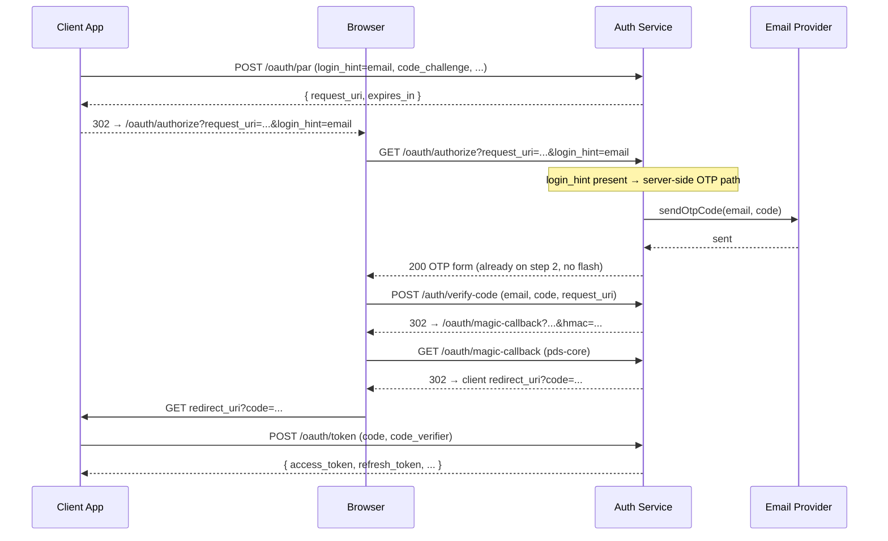
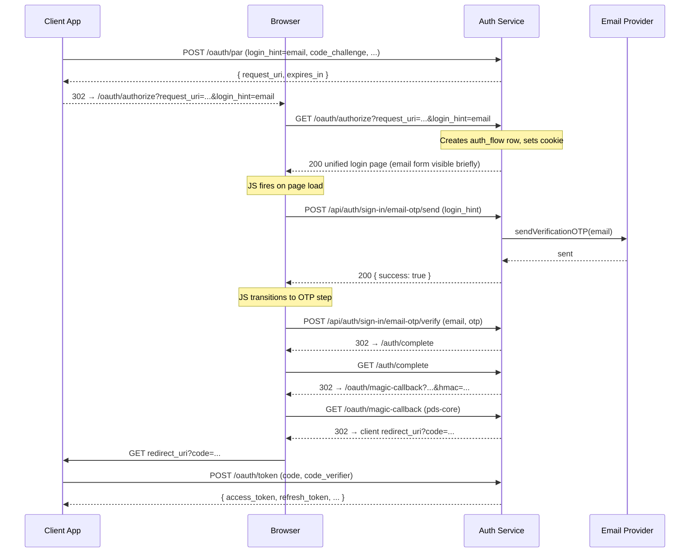
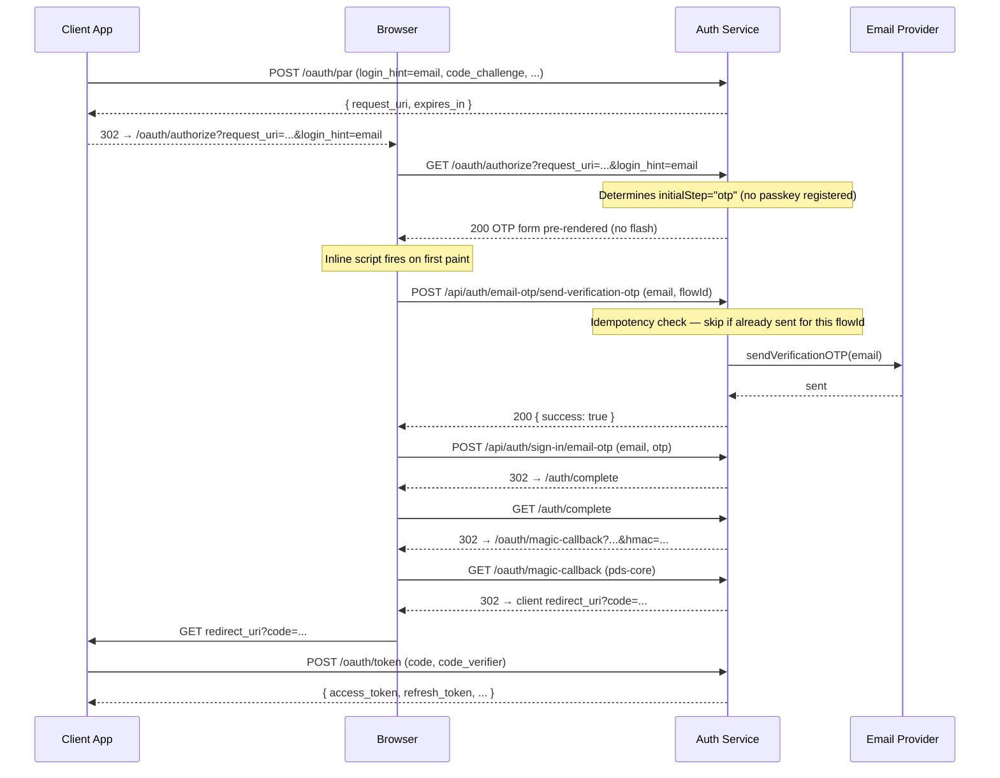

# OTP Send: Client-side vs. Server-side

Design decision record for `atproto-trf` / `atproto-ke8`.

## Background

When `GET /oauth/authorize` is called with a `login_hint` email (Flow 1), the
auth service needs to send an OTP to that address and show the OTP entry form.
There are two ways to trigger that send.

The original `magic-pds` branch sent the OTP **server-side** inside the GET
handler, then rendered the OTP form directly. The migration to better-auth
switched to a **client-side** approach: render the page, then have the browser
call the better-auth OTP endpoint via `fetch()` on page load.

## Old approach (magic-pds branch)

The OTP was sent server-side in the GET handler, then the OTP form was rendered
directly — no flash, no client-side JS send.



## Current approach (main branch)

The page is rendered first, then the browser calls the better-auth OTP endpoint
via `fetch()` on page load. This causes a brief flash of the email form before
the OTP step appears.

**Root cause of the flash:** The server always renders `#step-email` as the
visible initial state. The `fetch()` itself is not the cause — even if the OTP
were sent server-side, the flash would still occur if the server rendered the
email form first. The flash is eliminated by having the server render the
correct form (e.g. the OTP input) immediately, which is what the Method-Aware
Hybrid approach achieves.



## Why it was changed to client-side

The old approach used a custom `tokenService` (`magic-link/token.ts`) that could
be called synchronously in the GET handler. When migrating to better-auth
(`6c7c0c30`), OTP sending had to go through better-auth's own HTTP endpoint
(`POST /api/auth/sign-in/email-otp/send`). Calling that server-side requires
`auth.api.sendVerificationOTP()`, which is async and has its own session/cookie
behaviour. The simpler path was to let the browser call the endpoint directly —
better-auth handles its own CSRF for API calls automatically, so no CSRF token
threading was needed.

Note: the recovery flow (`recovery.ts`) already calls
`auth.api.sendVerificationOTP()` server-side successfully, so a server-side send
is known to be feasible.

## Comparison

### Summary

| | Old (magic-pds) | Current (main) | Method-Aware Hybrid (converged) |
|---|---|---|---|
| OTP send | Server-side in GET handler | Client-side JS on page load | Client-side POST, fired after pre-rendered OTP form is shown |
| Flash | None — OTP form rendered directly | Yes — email form briefly visible | None — server renders correct initial step |
| Duplicate GET | Second GET re-sends OTP (same bug) | Second GET re-sends OTP via JS | GET is side-effect-free; POST is idempotent via `flowId` |
| Route chain | authorize.ts → send-code.ts → verify-code.ts | login-page.ts (unified) | login-page.ts (unified, `initialStep` aware) |
| Session | Custom tokenService / sessionId | better-auth | better-auth |
| Future auth modes | Email only | Email only | Passkey / SIWx / social — determined per user |

### Client-side send (current)

| Pros | Cons |
|------|------|
| Simple — no server-side async call needed | Flash of email form before OTP step appears |
| better-auth CSRF handled automatically | Duplicate GET triggers second OTP send via JS |
| Resend button uses the same code path | OTP send can fail silently if JS errors |
| Social login buttons follow the same pattern | Requires JS — broken if browser blocks scripts |
| Easy to show loading states in UI | Extra round-trip: page load → JS fetch → OTP |

### Server-side send (old / proposed fix) — **rejected**

Moving `sendVerificationOTP()` into the `GET /oauth/authorize` handler was
considered as a fix for the UI flash but has been **explicitly rejected** for
the following reasons:

1. **Violates HTTP semantics.** `GET` must be safe and idempotent (RFC 9110
   §9.2.1). Sending an email is a state-mutating side effect and must not
   happen on a `GET` request.
2. **Breaks future multi-modal auth.** A `login_hint` identifies the user — it
   does not dictate the authentication method. Automatically sending an OTP
   email when a user loads the page is wrong if the user's preferred method is
   a Passkey, SIWx wallet signature, or federated social login. The server
   cannot know which method to use until it has looked up the user's registered
   credentials.
3. **Resend still needs the JS path.** The Resend button must call the OTP
   endpoint from the browser regardless, so the client-side send path cannot be
   eliminated entirely.

| Pros | Cons |
|------|------|
| No flash — OTP form rendered immediately | **Violates HTTP GET safety / idempotency** |
| Duplicate GETs blocked by request_uri dedup | **Assumes email OTP; breaks Passkeys / SIWx** |
| Works without JS | Error handling harder — no UI feedback mid-render |
| One fewer round-trip | Resend button still needs the JS path anyway |

## Method-Aware Hybrid Approach

The converged architecture separates **state determination** (what to show)
from **action execution** (sending the email) and keeps each on the correct
side of the HTTP boundary.

### Pillar 1 — State Determination (server-side, in `GET /oauth/authorize`)

The GET handler already creates the `auth_flow` row and reads the `login_hint`.
It should additionally look up the user's available authentication methods and
choose an `initialStep` value (e.g. `email`, `otp`, `passkey-prompt`). The
server then renders the HTML with the **correct DOM elements visible
immediately**, eliminating the flash without performing any side-effecting
action.

```
login_hint present + user exists + no passkey  →  initialStep = "otp"   (OTP form visible)
login_hint present + user exists + has passkey →  initialStep = "passkey-prompt"
login_hint present + user not found            →  initialStep = "otp"   (new user — OTP creates account)
no login_hint                                  →  initialStep = "email"  (email form visible)
```

### Pillar 2 — Action Execution (client-side POST)

When the browser receives the pre-rendered page showing the OTP input form, a
small inline script fires a background `POST` to send the OTP. This is
semantically correct: the user's intention to authenticate has already been
established (by the PAR request and the `login_hint`), and the `POST` expresses
that intent explicitly.

The target is the first-party auth endpoint on our own server
(`POST /api/auth/email-otp/send-verification-otp`). The browser never contacts
the email provider directly — the server receives the request, enforces
idempotency, and dispatches the email. This is not "client → email provider"
behaviour; it is "client → auth server → email provider", with the auth server
remaining in control throughout.

The flash disappears because the correct form is visible on first paint, not
because the email is sent before the page is served.



### Pillar 3 — Idempotency (API level, using `flowId`)

Browser pre-fetching, extensions, or rapid reloads can cause the background
`POST` to fire more than once. The `POST` endpoint must enforce idempotency:

- The client includes the `flowId` (already available in the page / cookie) in
  the request body.
- The server checks whether an OTP has already been sent for this `flowId` (via
  `ctx.db.getAuthFlowByRequestUri` or a dedicated `otpSentAt` column).
- The server validates that the `email` in the POST body matches the
  `login_hint` stored in the `auth_flow` row, preventing cross-session abuse
  where an attacker supplies another user's `flowId`.
- If an OTP was sent within the rate-limit window, return `200` without
  re-sending — do not return an error.
- **Enforcement location:** all of the above checks must live inside the
  `send-verification-otp` endpoint on the server. The client UI may skip a
  redundant call as an optimisation, but correctness must never depend on
  UI-side guards alone.

This also protects the Resend button: a rapid double-click will not dispatch
two emails.

### Why this supersedes both prior approaches

| Concern | Server-side GET | Client-side JS (current) | Method-Aware Hybrid |
|---|---|---|---|
| HTTP semantics | ❌ GET side-effect | ✅ POST side-effect | ✅ POST side-effect |
| UI flash | ✅ No flash | ❌ Flash | ✅ No flash |
| Future auth modes (Passkey etc.) | ❌ Assumes email OTP | ✅ Can be extended | ✅ Designed for it |
| Duplicate send protection | Partial (request_uri dedup) | ❌ Each GET re-sends | ✅ `flowId` idempotency |
| Works without JS | ✅ | ❌ | ⚠️ degraded — OTP form renders, user can submit manually; no auto-send |

## Open questions

- **`initialStep` lookup:** Where is the canonical place to check whether a
  user has a Passkey registered? This needs a helper in `auth-service` that
  queries better-auth's credential store before rendering the page.
- **`otpSentAt` schema change:** The idempotency check for Pillar 3 may require
  adding an `otp_sent_at` column to the `auth_flows` table. Evaluate whether
  the existing `flowId`-based dedup in `getAuthFlowByRequestUri` is sufficient
  or whether a separate flag is needed.
- **Error rendering for failed OTP send:** If the background `POST` fails (e.g.
  SMTP error), the OTP form is already visible but the code was never sent.
  The client script must surface a dismissible error banner and offer a Resend
  button — consistent with the current JS error-handling path.
