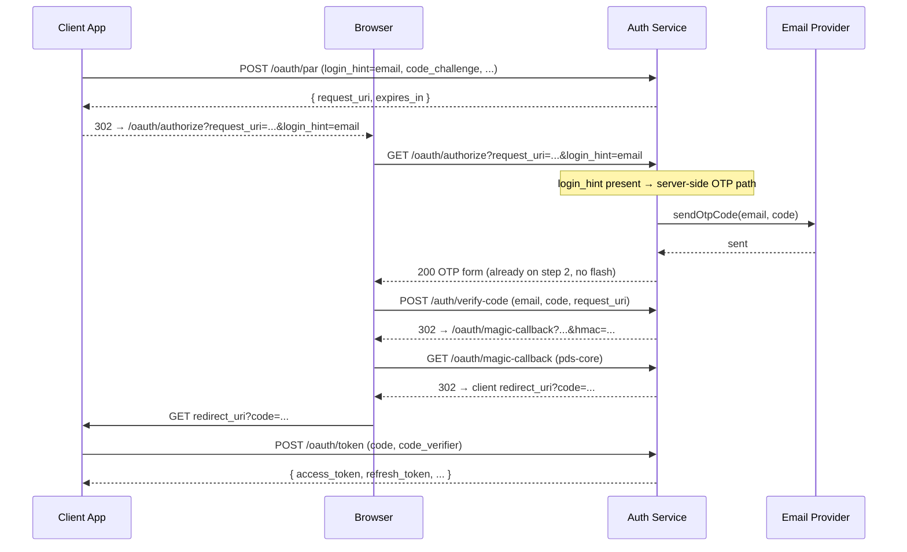
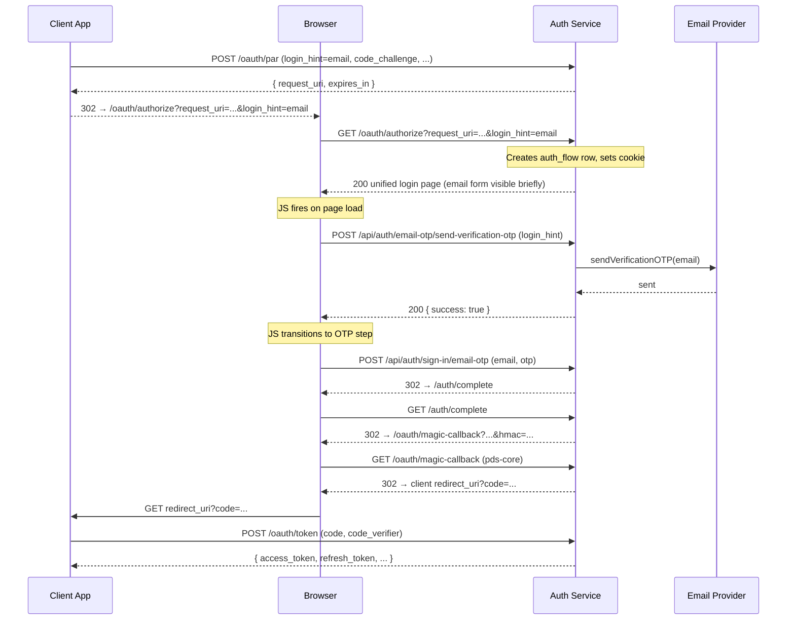
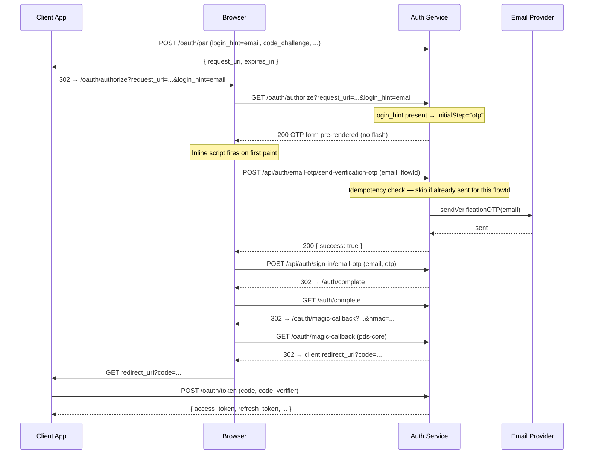

# OTP Send: Client-side vs. Server-side

Design decision record for `atproto-trf` / `atproto-ke8`.

## Background

When `GET /oauth/authorize` is called with a `login_hint` email (Flow 1), the
auth service needs to send an OTP to that address and show the OTP entry form.
There are two ways to trigger that send.

The original `magic-pds` branch sent the OTP **server-side** inside the GET
handler, then rendered the OTP form directly. The migration to better-auth
switched to a **client-side** approach: render the page, then have the browser
call the better-auth OTP endpoint via `fetch()` on page load.

## Old approach (magic-pds branch)

The OTP was sent server-side in the GET handler, then the OTP form was rendered
directly — no flash, no client-side JS send.



## Current approach (main branch)

The page is rendered first, then the browser calls the better-auth OTP endpoint
via `fetch()` on page load. This causes a brief flash of the email form before
the OTP step appears.

**Root cause of the flash:** The current implementation renders `#step-email` as
the visible initial state even when a `login_hint` is present. The `fetch()`
call itself is not the cause — the flash is purely a rendering decision. The
old `magic-pds` branch and the `atproto-ke8` stash both demonstrate the correct
fix: when `login_hint` is present, render `#step-otp` (and hide `#step-email`)
directly in the server response. OTP sending and form visibility are independent
choices; the server-side send approach always intended to combine them.



## Why it was changed to client-side

The old approach used a custom `tokenService` (`magic-link/token.ts`) that could
be called synchronously in the GET handler. When migrating to better-auth
(`6c7c0c30`), OTP sending had to go through better-auth's own HTTP endpoint
(`POST /api/auth/email-otp/send-verification-otp`). Calling that server-side requires
`auth.api.sendVerificationOTP()`, which is async and has its own session/cookie
behaviour. The simpler path was to let the browser call the endpoint directly —
better-auth handles its own CSRF for API calls automatically, so no CSRF token
threading was needed.

Note: the recovery flow (`recovery.ts`) already calls
`auth.api.sendVerificationOTP()` server-side successfully, so a server-side send
is known to be feasible.

## Comparison

### Summary

| | Old (magic-pds) | Current (main) | Method-Aware Hybrid (converged) |
|---|---|---|---|
| OTP send | Server-side in GET handler | Client-side JS on page load | Client-side POST, fired after pre-rendered OTP form is shown |
| Flash | None — OTP form rendered directly | Yes — email form briefly visible | None — server renders correct initial step |
| Duplicate GET | Second GET re-sends OTP (same bug) | Second GET re-sends OTP via JS | GET is side-effect-free; POST is idempotent via `flowId` |
| Route chain | authorize.ts → send-code.ts → verify-code.ts | login-page.ts (unified) | login-page.ts (unified, `initialStep` aware) |
| Session | Custom tokenService / sessionId | better-auth | better-auth |
| Future auth modes | Email only | Email only | Extensible — add methods when they are implemented |

### Client-side send (current)

| Pros | Cons |
|------|------|
| Simple — no server-side async call needed | Flash of email form before OTP step appears |
| better-auth CSRF handled automatically | Duplicate GET triggers second OTP send via JS |
| Resend button uses the same code path | OTP send can fail silently if JS errors |
| Social login buttons follow the same pattern | Requires JS — broken if browser blocks scripts |
| Easy to show loading states in UI | Extra round-trip: page load → JS fetch → OTP |

### Server-side send (old / proposed fix) — **rejected**

Moving `sendVerificationOTP()` into the `GET /oauth/authorize` handler was
considered as a fix for the UI flash but has been **explicitly rejected** for
the following reasons:

1. **Adds a method-assuming side effect at the wrong layer.** The GET handler
   already creates an `auth_flow` row and sets a cookie — it is not side-effect
   free. However, those mutations are *structurally required* by the OAuth
   authorization code flow. Sending an OTP email is different: it hard-codes
   email OTP as the authentication method before the handler has consulted the
   user's available credentials. If the user has a social account configured
   (already possible today), auto-sending email OTP is unexpected. When further
   auth methods are added, this assumption will need to be unwound at the wrong
   layer (the GET handler) rather than in the auth-method selection logic where
   it belongs.
2. **HTTP semantics (secondary concern).** RFC 9110 §9.2.1 states GET should be
   safe and idempotent. The endpoint already violates this strictly (cookie +
   DB row), so this argument alone is not decisive. It is still worth noting as
   a design smell, and the combined weight of the two points makes a clear case
   for keeping state-mutating auth actions on POST.
3. **Resend still needs the JS path.** The Resend button must call the OTP
   endpoint from the browser regardless, so the client-side send path cannot be
   eliminated entirely.

| Pros | Cons |
|------|------|
| No flash — OTP form rendered immediately | **Assumes email OTP before credentials are consulted** |
| Duplicate GETs blocked by request_uri dedup | HTTP GET semantics (secondary — endpoint already has side effects) |
| Works without JS | Error handling harder — no UI feedback mid-render |
| One fewer round-trip | Resend button still needs the JS path anyway |

## Method-Aware Hybrid Approach

The converged architecture separates **state determination** (what to show)
from **action execution** (sending the email) and keeps each on the correct
side of the HTTP boundary.

### Pillar 1 — State Determination (server-side, in `GET /oauth/authorize`)

The GET handler already creates the `auth_flow` row and reads the `login_hint`.
It should additionally determine the correct `initialStep` and render the HTML
with the **correct DOM elements visible immediately**, eliminating the flash
without performing any method-assuming side effect.

Today there are two cases:

```
login_hint present  →  initialStep = "otp"   (OTP form visible, email form hidden)
no login_hint       →  initialStep = "email"  (email form visible)
```

When additional auth methods (e.g. Passkeys, social-only accounts) are
introduced, the `initialStep` logic should be extended to consult the user's
registered credentials and select the appropriate initial mode at that point.

### Pillar 2 — Action Execution (client-side POST)

When the browser receives the pre-rendered page showing the OTP input form, a
small inline script fires a background `POST` to send the OTP. This is
semantically correct: the user's intention to authenticate has already been
established (by the PAR request and the `login_hint`), and the `POST` expresses
that intent explicitly.

The target is the first-party auth endpoint on our own server
(`POST /api/auth/email-otp/send-verification-otp`). The browser never contacts
the email provider directly — the server receives the request, enforces
idempotency, and dispatches the email. The flow is
`client → auth server → email provider`, with the auth server remaining in
control throughout.

The flash disappears because the correct form is visible on first paint, not
because the email is sent before the page is served.



### Pillar 3 — Idempotency (duplicate-send prevention)

#### Production evidence

Investigation of production logs confirmed the exact failure mode. The duplicate
`GET /oauth/authorize` requests originate from residential ISPs (not CDN nodes),
carrying a full Chrome user-agent string. **The duplicate page load executes
JavaScript**, including the auto-send script that calls
`POST /api/auth/email-otp/send-verification-otp`. The observed sequence for a
single login attempt:

```
t+0.0s  GET /oauth/authorize → auth_flow created (reused=false), page served
t+2.0s  POST send-verification-otp → first OTP email sent (user's real browser)
t+4.5s  GET /oauth/authorize → duplicate detected (reused=true), page re-served to StayFocusd
t+5.8s  POST send-verification-otp → second OTP email sent (StayFocusd's JS execution)
```

The `request_uri` dedup in `getAuthFlowByRequestUri` correctly prevents a
second `auth_flow` row. It does **not** prevent the duplicate page's JS from
firing the auto-send, because the auto-send hits better-auth's OTP endpoint
directly, not the `auth_flow` table.

#### Option A — `otpAlreadySent` flag (recommended near-term fix)

Because the server already knows whether this is a duplicate load (`existingFlow`
is truthy in `createLoginPageRouter`), it can pass a single extra bit of state
to the page:

1. When `reused=true`, render the page with `otpAlreadySent: true` embedded in
   the inline script.
2. The JS checks this flag on load: if set, skip the auto-send and display the
   OTP form immediately with a message such as "Code already sent to your email".
3. The Resend button still works — it is a deliberate user action, not an
   auto-send, so it is not gated by the flag.

This is the lowest-risk fix: it requires no changes to better-auth, no schema
migration, and no new endpoints. It is fully compatible with the hybrid approach
since the server is simply conveying state it already knows.

#### Option B — Server-side wrapper endpoint (longer term)

If we introduce a custom wrapper endpoint around
`POST /api/auth/email-otp/send-verification-otp`, we can enforce idempotency
server-side:

- Accept a `flowId` in the request body and record `otp_sent_at` on the
  `auth_flows` row when the first OTP is dispatched.
- On subsequent calls with the same `flowId`, return `200` without re-sending
  if an OTP was sent within the rate-limit window.
- Validate that the `email` in the request body matches the `login_hint` stored
  on the `auth_flow` row, preventing cross-session abuse.

Note: we do not fully control better-auth's built-in
`POST /api/auth/email-otp/send-verification-otp` endpoint, so Option B
requires wrapping or proxying it rather than modifying it in-place.

- **Enforcement location:** all server-side idempotency checks must live inside
  the wrapper endpoint. The client UI may skip a redundant call as an
  optimisation, but correctness must never depend on UI-side guards alone.

Option B is more robust (protects even if the client is misbehaving), but Option A
should be implemented first as it resolves the confirmed production issue
immediately. The two options are complementary and can coexist.

This also protects the Resend button in Option B: a rapid double-click will not
dispatch two emails.

### Why this supersedes both prior approaches

| Concern | Server-side GET | Client-side JS (current) | Method-Aware Hybrid |
|---|---|---|---|
| HTTP semantics | ❌ GET side-effect | ✅ POST side-effect | ✅ POST side-effect |
| UI flash | ✅ No flash | ❌ Flash | ✅ No flash |
| Future auth modes (Passkey etc.) | ❌ Assumes email OTP before consulting credentials | ✅ Can be extended | ✅ Extension point is explicit |
| Duplicate send protection | Partial (request_uri dedup) | ❌ Each GET re-sends | ✅ `otpAlreadySent` flag; optional server-side wrapper |
| Works without JS | ✅ | ❌ | ⚠️ degraded — OTP form renders, user can submit manually; no auto-send |

## Open questions

- **`initialStep` rendering implementation:** A stash (`atproto-ke8`) already
  renders `#step-otp` visible when `login_hint` is present. That change needs
  to land before the Pillar 2 auto-send script can work correctly.
- **`otpAlreadySent` flag implementation:** `createLoginPageRouter` already
  knows when a flow is reused (`existingFlow` is truthy). The remaining work is
  to thread a boolean into the rendered page and add a JS guard that skips
  the auto-send and displays "Code already sent to your email" instead.
- **Option B wrapper endpoint:** Decide whether to implement the server-side
  wrapper (`otp_sent_at` on `auth_flows`) after Option A lands. Evaluate whether
  better-auth's built-in rate-limiting is sufficient or whether the wrapper is
  needed for Resend double-click protection.
- **Error rendering for failed OTP send:** If the background `POST` fails (e.g.
  SMTP error), the OTP form is already visible but the code was never sent.
  The client script must surface a dismissible error banner and offer a Resend
  button — consistent with the current JS error-handling path.
