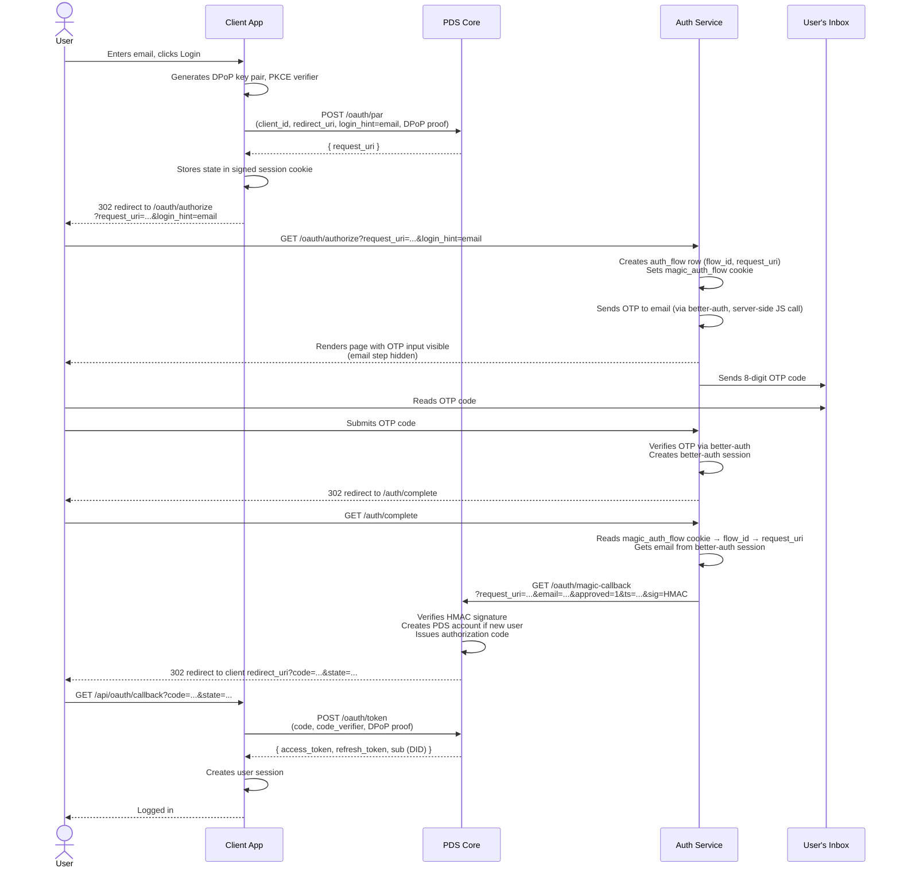
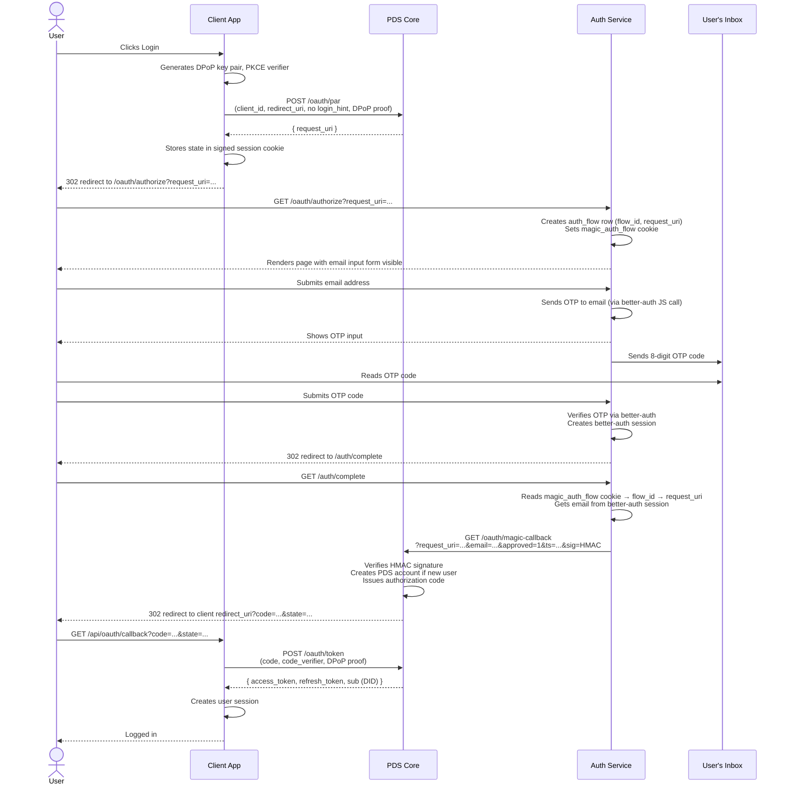

# Login Flows & Integration Guide

## Overview

ePDS is a standard AT Protocol PDS. Any AT Protocol OAuth client works against it.
The sections below describe the two supported login flows and the ePDS-specific
conventions your client should follow.

## Login Flows

ePDS supports two OAuth login flows for client apps. The difference is whether the
client app collects the user's email itself or delegates that to the auth server.

## Flow 1 — App has its own email form

The client app shows an email input, then passes the email as `login_hint` to PAR.
The auth server skips its own email step and goes straight to OTP input.

1. User enters email in the client app
2. Client POSTs to its own `/api/oauth/login` endpoint
3. Client sends PAR to PDS with `login_hint=<email>`
4. PDS responds with `request_uri`
5. Client redirects browser to `/oauth/authorize?request_uri=...&login_hint=<email>`
6. Auth server renders OTP input page (email step hidden), sends OTP to user
7. User enters OTP code
8. Auth server verifies OTP via better-auth → redirects to `/auth/complete`
9. Auth server issues authorization code via `/oauth/magic-callback`
10. Client exchanges code for tokens (standard AT Protocol OAuth)

> **Known issue**: there is a brief flash of the email form before the OTP step
> appears. Tracked in [atproto-ke8 / atproto-trf].

## Flow 2 — App has a simple login button

> **Not yet tested end-to-end.** Tracked in atproto-daj.

The client app has no email form. The auth server collects the email itself.

1. User clicks "Login" in the client app
2. Client POSTs to its own `/api/oauth/login` endpoint (no `login_hint`)
3. Client sends PAR to PDS (no `login_hint`)
4. PDS responds with `request_uri`
5. Client redirects browser to `/oauth/authorize?request_uri=...`
6. Auth server renders email input form
7. User enters email and submits
8. Auth server sends OTP to user, shows OTP input
9. User enters OTP code
10. Auth server verifies OTP via better-auth → redirects to `/auth/complete`
11. Auth server issues authorization code via `/oauth/magic-callback`
12. Client exchanges code for tokens (standard AT Protocol OAuth)

## Sequence Diagrams

### Flow 1 — App has its own email form



### Flow 2 — App has a simple login button

> **Not yet tested end-to-end.** Tracked in atproto-daj.



## Integration Reference

### PAR Request

Send a Pushed Authorization Request to `<pds-url>/oauth/par`:

```http
POST /oauth/par HTTP/1.1
Content-Type: application/x-www-form-urlencoded

response_type=code
&client_id=<your-client-id>
&redirect_uri=<your-callback-url>
&scope=atproto
&code_challenge=<pkce-challenge>
&code_challenge_method=S256
&login_hint=<email>        ← optional, for Flow 1
```

### Authorization Redirect

Redirect the user to the `request_uri` returned by PAR:

```
https://<pds-url>/oauth/authorize?request_uri=<request_uri>&client_id=<client_id>
```

If you included `login_hint` in the PAR request, also include it here so the auth
server can render the OTP step immediately (no email form shown to the user).

### Token Exchange

After the user authenticates, the auth server redirects back to your `redirect_uri`
with a `code`. Exchange it for tokens using standard AT Protocol OAuth token exchange
with DPoP.

### Client Metadata

Register your client by hosting a JSON document at your `client_id` URL:

```json
{
  "client_id": "https://yourapp.example.com/client-metadata.json",
  "client_name": "Your App Name",
  "redirect_uris": ["https://yourapp.example.com/api/oauth/callback"],
  "scope": "atproto",
  "grant_types": ["authorization_code", "refresh_token"],
  "response_types": ["code"],
  "token_endpoint_auth_method": "none",
  "dpop_bound_access_tokens": true
}
```

### User Handles

Users get a random handle (e.g. `a3x9kf.epds-poc1.example.com`). No email-derived
handles are used, for privacy.

## Why redirect to the auth server at all? (Flow 1)

Even in Flow 1, where the client already has the email, the redirect to
`/oauth/authorize` on the auth server is architecturally necessary:

- The OAuth authorization code must be issued by the authorization server
  (the auth subdomain), not the client
- Future authentication mechanisms (passkeys, WebAuthn) require the authenticator
  to be bound to the auth server's origin — the client app's origin won't do

A possible future optimisation (tracked in [atproto-tlm]) would be a dedicated
endpoint that accepts `login_hint`, sends the OTP, and renders the OTP input
directly — skipping the intermediate login page entirely.
