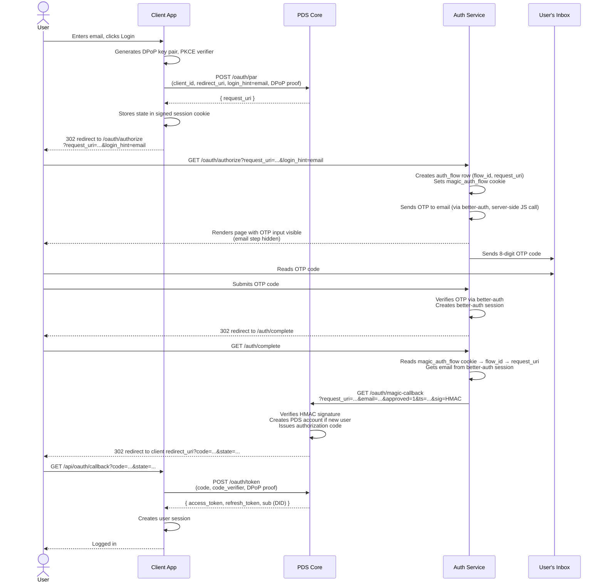
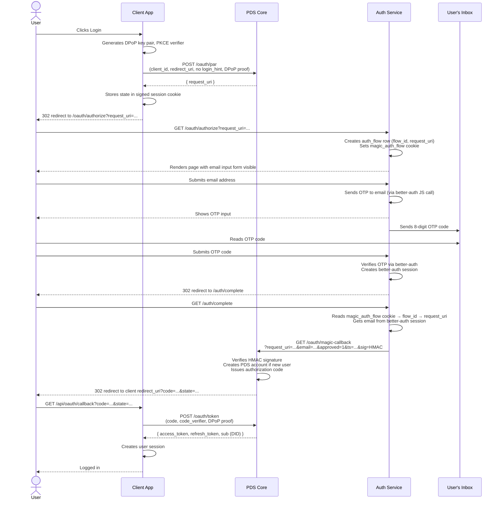

# Login Flows & Integration Guide

## Overview

ePDS is a standard AT Protocol PDS. Any AT Protocol OAuth client works against it.
The sections below describe the two supported login flows and the ePDS-specific
conventions your client should follow.

## Login Flows

ePDS supports two OAuth login flows for client apps. The difference is whether the
client app collects the user's email itself or delegates that to the auth server.

## Flow 1 — App has its own email form

The client app shows an email input, then passes the email as `login_hint` to PAR.
The auth server skips its own email step and goes straight to OTP input.

1. User enters email in the client app
2. Client POSTs to its own `/api/oauth/login` endpoint
3. Client sends PAR to PDS with `login_hint=<email>`
4. PDS responds with `request_uri`
5. Client redirects browser to `/oauth/authorize?request_uri=...&login_hint=<email>`
6. Auth server renders OTP input page (email step hidden), sends OTP to user
7. User enters OTP code
8. Auth server verifies OTP via better-auth → redirects to `/auth/complete`
9. Auth server issues authorization code via `/oauth/magic-callback`
10. Client exchanges code for tokens (standard AT Protocol OAuth)

## Flow 2 — App has a simple login button

The client app has no email form. The auth server collects the email itself.

1. User clicks "Login" in the client app
2. Client POSTs to its own `/api/oauth/login` endpoint (no `login_hint`)
3. Client sends PAR to PDS (no `login_hint`)
4. PDS responds with `request_uri`
5. Client redirects browser to `/oauth/authorize?request_uri=...`
6. Auth server renders email input form
7. User enters email and submits
8. Auth server sends OTP to user, shows OTP input
9. User enters OTP code
10. Auth server verifies OTP via better-auth → redirects to `/auth/complete`
11. Auth server issues authorization code via `/oauth/magic-callback`
12. Client exchanges code for tokens (standard AT Protocol OAuth)

## Sequence Diagrams

### Flow 1 — App has its own email form



### Flow 2 — App has a simple login button



## Integration Reference

### Client Metadata

Host a JSON document at your `client_id` URL. This is fetched by ePDS to validate
your client and by the auth service for branding (app name, logo, email templates):

```json
{
  "client_id": "https://yourapp.example.com/client-metadata.json",
  "client_name": "Your App Name",
  "client_uri": "https://yourapp.example.com",
  "logo_uri": "https://yourapp.example.com/logo.png",
  "redirect_uris": ["https://yourapp.example.com/api/oauth/callback"],
  "scope": "atproto transition:generic",
  "grant_types": ["authorization_code", "refresh_token"],
  "response_types": ["code"],
  "token_endpoint_auth_method": "none",
  "dpop_bound_access_tokens": true,
  "email_template_uri": "https://yourapp.example.com/email-template.html",
  "email_subject_template": "{{code}} — Your {{app_name}} code",
  "brand_color": "#000000",
  "background_color": "#ffffff"
}
```

`email_template_uri`, `email_subject_template`, `brand_color`, and
`background_color` are optional ePDS extensions. If omitted, the auth service
falls back to default Certified branding.

The email template must be an HTML file containing at minimum a `{{code}}`
placeholder. Supported template variables:

| Variable | Description |
| --- | --- |
| `{{code}}` | The 8-digit OTP code (required) |
| `{{app_name}}` | Value of `client_name` from your metadata |
| `{{logo_uri}}` | Value of `logo_uri` from your metadata |
| `{{#is_new_user}}...{{/is_new_user}}` | Shown only on first sign-up |
| `{{^is_new_user}}...{{/is_new_user}}` | Shown only on subsequent sign-ins |

### PKCE and DPoP Helpers

Both flows require PKCE and DPoP. Here are reference implementations in TypeScript
(from the [maearth-demo](https://github.com/hypercerts-org/maearth-demo) app):

```typescript
import * as crypto from 'node:crypto'

// PKCE
export function generateCodeVerifier(): string {
  return crypto.randomBytes(32).toString('base64url')
}

export function generateCodeChallenge(verifier: string): string {
  return crypto.createHash('sha256').update(verifier).digest('base64url')
}

// DPoP key pair — generate once per OAuth flow, never reuse across flows
export function generateDpopKeyPair() {
  const { publicKey, privateKey } = crypto.generateKeyPairSync('ec', {
    namedCurve: 'P-256',
  })
  return {
    privateKey,
    publicJwk: publicKey.export({ format: 'jwk' }),
    privateJwk: privateKey.export({ format: 'jwk' }),
  }
}

// Restore a DPoP key pair from a serialized private JWK (e.g. from session)
export function restoreDpopKeyPair(privateJwk: crypto.JsonWebKey) {
  const privateKey = crypto.createPrivateKey({ key: privateJwk, format: 'jwk' })
  const publicKey = crypto.createPublicKey(privateKey)
  return { privateKey, publicJwk: publicKey.export({ format: 'jwk' }) }
}

// Create a DPoP proof JWT
export function createDpopProof(opts: {
  privateKey: crypto.KeyObject
  jwk: object
  method: string
  url: string
  nonce?: string
  accessToken?: string
}): string {
  const header = { alg: 'ES256', typ: 'dpop+jwt', jwk: opts.jwk }
  const payload: Record<string, unknown> = {
    jti: crypto.randomUUID(),
    htm: opts.method,
    htu: opts.url,
    iat: Math.floor(Date.now() / 1000),
  }
  if (opts.nonce) payload.nonce = opts.nonce
  if (opts.accessToken) {
    payload.ath = crypto
      .createHash('sha256')
      .update(opts.accessToken)
      .digest('base64url')
  }

  const headerB64 = Buffer.from(JSON.stringify(header)).toString('base64url')
  const payloadB64 = Buffer.from(JSON.stringify(payload)).toString('base64url')
  const signingInput = `${headerB64}.${payloadB64}`
  const sig = crypto.sign('sha256', Buffer.from(signingInput), opts.privateKey)
  return `${signingInput}.${derToRaw(sig).toString('base64url')}`
}

// Convert DER-encoded ECDSA signature to raw r||s (required for ES256 JWTs)
function derToRaw(der: Buffer): Buffer {
  let offset = 2
  if (der[1]! > 0x80) offset += der[1]! - 0x80
  offset++ // skip 0x02
  const rLen = der[offset++]!
  let r = der.subarray(offset, offset + rLen)
  offset += rLen
  offset++ // skip 0x02
  const sLen = der[offset++]!
  let s = der.subarray(offset, offset + sLen)
  if (r.length > 32) r = r.subarray(r.length - 32)
  if (s.length > 32) s = s.subarray(s.length - 32)
  const raw = Buffer.alloc(64)
  r.copy(raw, 32 - r.length)
  s.copy(raw, 64 - s.length)
  return raw
}
```

### PAR Request (Flow 1)

Send a Pushed Authorization Request to `<pds-url>/oauth/par`. The DPoP nonce
retry pattern is required — ePDS always demands a nonce on the first attempt:

```typescript
const parBody = new URLSearchParams({
  client_id: clientId,
  redirect_uri: redirectUri,
  response_type: 'code',
  scope: 'atproto transition:generic',
  state,
  code_challenge: codeChallenge,
  code_challenge_method: 'S256',
  // Flow 1 only — omit for Flow 2:
  login_hint: email,
})

// First attempt (will get a 400 with dpop-nonce)
let parRes = await fetch(parEndpoint, {
  method: 'POST',
  headers: { 'Content-Type': 'application/x-www-form-urlencoded', DPoP: dpopProof },
  body: parBody.toString(),
})

// Retry with nonce if required
if (!parRes.ok) {
  const dpopNonce = parRes.headers.get('dpop-nonce')
  if (dpopNonce && parRes.status === 400) {
    dpopProof = createDpopProof({ privateKey, jwk: publicJwk, method: 'POST', url: parEndpoint, nonce: dpopNonce })
    parRes = await fetch(parEndpoint, {
      method: 'POST',
      headers: { 'Content-Type': 'application/x-www-form-urlencoded', DPoP: dpopProof },
      body: parBody.toString(),
    })
  }
}

const { request_uri } = await parRes.json()
```

### Authorization Redirect

Redirect the user to `/oauth/authorize` with the `request_uri` from PAR.
For Flow 1, also pass `login_hint` so the auth server renders the OTP form
directly (no email form shown to the user):

```typescript
// Flow 1
const authUrl = `${authEndpoint}?client_id=${encodeURIComponent(clientId)}&request_uri=${encodeURIComponent(request_uri)}&login_hint=${encodeURIComponent(email)}`

// Flow 2
const authUrl = `${authEndpoint}?client_id=${encodeURIComponent(clientId)}&request_uri=${encodeURIComponent(request_uri)}`
```

Store the DPoP private key, `codeVerifier`, and `state` in a signed HttpOnly
session cookie so the callback handler can retrieve them:

```typescript
// Before redirecting, save OAuth state in a signed cookie
response.cookies.set('oauth_session', signedSessionCookie, {
  httpOnly: true,
  secure: true,
  sameSite: 'lax',
  maxAge: 600, // 10 minutes — matches PAR request_uri lifetime
  path: '/',
})
```

### Token Exchange (Callback)

After the user authenticates, ePDS redirects to your `redirect_uri` with `?code=`
and `?state=`. Validate `state`, then exchange the code for tokens with DPoP:

```typescript
// Verify state matches what we stored
if (params.state !== sessionData.state) throw new Error('state mismatch')

const { privateKey, publicJwk } = restoreDpopKeyPair(sessionData.dpopPrivateJwk)

const tokenBody = new URLSearchParams({
  grant_type: 'authorization_code',
  code: params.code,
  redirect_uri: redirectUri,
  client_id: clientId,
  code_verifier: sessionData.codeVerifier,
})

// First attempt
let dpopProof = createDpopProof({ privateKey, jwk: publicJwk, method: 'POST', url: tokenEndpoint })
let tokenRes = await fetch(tokenEndpoint, {
  method: 'POST',
  headers: { 'Content-Type': 'application/x-www-form-urlencoded', DPoP: dpopProof },
  body: tokenBody.toString(),
})

// Retry with nonce if required
if (!tokenRes.ok) {
  const dpopNonce = tokenRes.headers.get('dpop-nonce')
  if (dpopNonce) {
    dpopProof = createDpopProof({ privateKey, jwk: publicJwk, method: 'POST', url: tokenEndpoint, nonce: dpopNonce })
    tokenRes = await fetch(tokenEndpoint, {
      method: 'POST',
      headers: { 'Content-Type': 'application/x-www-form-urlencoded', DPoP: dpopProof },
      body: tokenBody.toString(),
    })
  }
}

const { access_token, sub: userDid } = await tokenRes.json()
```

The `sub` field in the token response is the user's DID (e.g. `did:plc:abc123...`).
Resolve it to a handle via the PLC directory:

```typescript
const plcRes = await fetch(`https://plc.directory/${userDid}`)
const { alsoKnownAs } = await plcRes.json()
const handle = alsoKnownAs?.find((u: string) => u.startsWith('at://'))
  ?.replace('at://', '')
// e.g. "a3x9kf.epds-poc1.example.com"
```

### User Handles

Users get a random handle (e.g. `a3x9kf.epds-poc1.example.com`). Handles are
not email-derived, for privacy.

## Why redirect to the auth server at all? (Flow 1)

Even in Flow 1, where the client already has the email, the redirect to
`/oauth/authorize` on the auth server is required by the AT Protocol OAuth spec:

- The OAuth authorization code must be issued by the authorization server
  (the auth subdomain), not the client
- Future authentication mechanisms (passkeys, WebAuthn) require the authenticator
  to be bound to the auth server's origin — the client app's origin won't do
